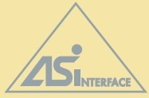
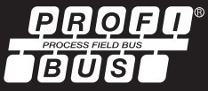
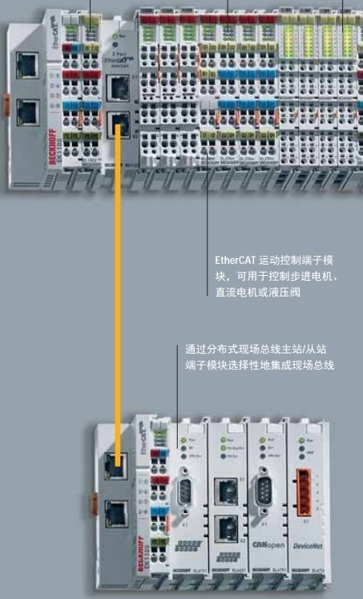

# 工业控制常用的接口协议

## I/O接口概念

I/O接口是一电子电路(以IC芯片或接口板形式出现 ),其内有若干专用寄存器和相应的控制逻辑电路构成。它是CPU和I/O设备之间交换信息的媒介和桥梁。CPU与外部设备、存储器的连接和数据交换都需要通过接口设备来实现，前者被称为I/O接口，而后者则被称为存储器接口。存储器通常在CPU的同步控制下工作，接口电路比较简单；而I/O设备品种繁多，其相应的接口电路也各不相同，因此，习惯上说到接口只是指I/O接口。

## I/O接口基本功能

（1）进行端口地址[译码](https://baike.baidu.com/item/%E8%AF%91%E7%A0%81)设备选择。

（2）向CPU提供I/O设备的状态信息和进行命令译码。

（3）进行定时和相应时序控制。

（4）对传送数据提供缓冲，以消除计算机与外设在“定时”或数据处理速度上的差异。

（5）提供计算机与外设间有关信息格式的相容性变换。提供有关电气的适配

（6）还可以中断方式实现CPU与外设之间信息的交换。

## 控制方式

（1）程序查询方式

这种方式下，CPU通过I/O指令询问指定外设当前的状态，如果外设准备就绪，则进行数据的输入或输出，否则CPU等待，循环查询。

这种方式的优点是结构简单，只需要少量的硬件电路即可，缺点是由于CPU的速度远远高于外设，因此通常处于等待状态，工作效率很低

（2）中断处理方式

在这种方式下，CPU不再被动等待，而是可以执行其他程序，一旦外设为数据交换准备就绪，可以向CPU提出服务请求，CPU如果响应该请求，便暂时停止当前程序的执行，转去执行与该请求对应的服务程序，完成后，再继续执行原来被中断的程序。

中断处理方式的优点是显而易见的，它不但为CPU省去了查询外设状态和等待外设就绪所花费的时间，提高了CPU的工作效率，还满足了外设的实时要求。但需要为每个I/O设备分配一个中断请求号和相应的中断服务程序，此外还需要一个中断控制器（I/O接口芯片）管理I/O设备提出的中断请求，例如设置中断屏蔽、中断请求优先级等。

此外，中断处理方式的缺点是每传送一个字符都要进行中断，启动中断控制器，还要保留和恢复现场以便能继续原程序的执行，花费的工作量很大，这样如果需要大量数据交换，系统的性能会很低。

（3）DMA（直接存储器存取）传送方式

DMA最明显的一个特点是它不是用软件而是采用一个专门的控制器来控制内存与外设之间的数据交流，无须CPU介入，大大提高CPU的工作效率。

在进行DMA数据传送之前，DMA控制器会向CPU申请总线控制 权，CPU如果允许，则将控制权交出，因此，在数据交换时，总线控制权由DMA控制器掌握，在传输结束后，DMA控制器将总线控制权交还给CPU。

（4）无条件传送方式

（5）I/O通道方式

（6）I/O处理机方式

## 工业控制网络

工业控制网络一般为局域网，作用范围一般在几km之内。将分布在生产装置周围的测控设备连接为功能各异的自动化系统。控制网络遍布在工厂的生产车间、装配流水线、温室、粮库、堤坝、隧道、各种交通管系统、建筑、军工、消防、环境检测、楼宇家居等处。

## 工业控制网络的节点

工业控制网络的节点大都是具有计算与通信能力的测量设备。它们可能具有嵌入式CPU，但功能比较单一，其计算能力也许远不及普通PC，也没有键盘、显示等人机交互接口。有的甚至不带CPU、单片机，只带有简单的通信接口，例如限位开关、感应开关等各类开关，光电、温度、压力、流量、物位等各种传感器、变送器，各种数据采集装置等等。

## 控制网络的任务与工作环境

工业控制网络要面临工业生产的强电磁干扰，面临各种机械振动，面临严寒酷暑的野外工作环境，要去控制网络能适应这种恶劣的工作环境。另外，自控设备千差万别，实现控制网络的互联与互操作往往十分困难。

## 控制网络的实时性要求

控制网络必须满足对控制的实时性要求。实时控制对某些变量的数据往往要求准确定时刷新，控制作用必须在一定时限内完成，或者相关的控制动作一定要按事项规定的先后顺序完成[1]。

## 现场接口分类

基于控制网络的这些特点，其中的各种接口必须保证满足控制网络的要求。目前工业现场的接口种类有以下四类[2]：

（1）平台相关性通用协议：OPC/ DDE

OPC 是为了不同供应厂商的设备和应用程序之间的软件接口标准化，使其间的数据交换更加简单化的目的而提出的。作为结果，从而可以向用户提供不依靠于特定开发语言和开发环境的可以自由组合使用的过程控制软件组件产品。

（2）平台无关性通讯协议：ModBus、ProfiBus

Modbus 协议是应用于电子控制器上的一种通用语言。 通过此协议，控制器相互之间、控制器经由网络（例如以太网）和其它设备之间可以通信。它已经成为一通用工业标准。有了它，不同厂商生产的控制设备可以连成工业网络，进行集中监控。Profibus，是一种国际化、开放式、不依赖于设备生产商的现场总线标准。 Profibus 传送速度可在 9．6kbaud～12Mbaud 范围内选择且当总线系统启动时， 所有连接到总线上的装置应该被设成相同的速度。广泛适用于制造业自动化、流程工业自动化和楼宇、交通电力等其他领域自动化。Profibus是一种用于工厂自动化车间级监控和现场设备层数据通信与控制的现场总线技术。

（3）平台无关专有协议：大部分DCS协议、工业以太网协议

（4）特殊协议：编程口、打印口等特殊方式取得的协议

工业传输通讯的协议种类较多主要有历史遗留和人为垄断两方面的原因。虽然目前还有大量的现场总线标准，但没有任何一种标准比工业以太网更具生命力[2]。

# 各种现场总线/协议/接口总结[3]

 

| **工业自动化总线/协议/接口的名称**   | **标识**                                   | **特点简介**                                 | **说明**                                   |
| ---------------------- | ---------------------------------------- | ---------------------------------------- | ---------------------------------------- |
| ASI                    |                     | 用于下位控制级的传感器/执行器总线 AS-interface 用于将传感器和执行器连接 至上位控制层，布线简单、经济。AS interface 符合国际标准EN 50295 和IEC 62026-2 标准。 AS-Interface（AS-i = 执行器/传感器接口） 是用于连接执行器和传感器的现场总线通讯方案。 | 【整理】ASI接口/协议/规范                          |
| BACnet==楼宇自动控制网络数据通讯协议 |  | Building Automation Control Network      | [【整理】工业自动化之楼宇自动化之通讯协议：BACnet](http://www.crifan.com/industrial_automation_building_automation_communication_protocol_bacnet) |
| CANopen                |  | 用于执行器/传感器领域的多主站总线 对总线带宽的有效利用使得CANopen能 够在数据传输速率相对较低的情况下实 现较短的系统响应时间。CAN 总线的主 要优点有：数据安全性高，能够保留多 主站能力。 |                                          |
| CC-Link                |  | 主要针对亚洲市场的现场总线CC-Link（Control & Communication Link， 控制与通信链路）是一种开放式总线系统，用于控制级和现场总线级之间的通讯，应用范围主要为亚洲地区。 |                                          |
| ControlNet             |  | 标准化现场总线ControlNet 是一种开放式标准现场总线系统。该总线协议允许循环数据和非循环数据同时通过总线进行交换，而两者之间互不影响。 |                                          |
| DALI                   |  | 楼宇自动化领域的通讯标准 DALI 标准（IEC60929）是一种跨越厂商的协议，其目的是在照明应用中确保电子镇流器的互用性。这个新标准用于替代1-10V调光器接口。 数字可寻址照明接口（DALI，Digital Addressable Lighting Interface）是一种楼宇自动 化标准，用于电子镇流器的数字控制。 DALI 作为一种子系统使用，例如照明、百叶帘或温度控制，可直接与楼宇管理 系统进行通讯。 | [【整理】工业自动化总线之楼宇自动化之照明接口：DALI](http://www.crifan.com/industrial_automation_building_automation_light_interface_dali) |
| DeviceNet              |  | 采用CAN技术的设备总线DeviceNet 是一种传感器/执行器总线系统， 起源于美国，但现在在欧洲和亚洲地区也得到越来越多的应用。DeviceNet 基于CAN（Controller Area Net，控制器局域网）总线。 |                                          |
| DMX                    |  |                                          |                                          |
| EIB                    |  | 楼宇自动化领域的通讯标准EIB（European Installation Bus，欧洲安装 总线） 是一种用于楼宇布线的总线系统，主要在欧洲地区广泛应用。 |                                          |
| EnOcean                |  | 免维护、无需电池、无需接线是一种无线技术。主要用于楼宇自动化：不同的设备模块（比如一个灯的开关）内嵌了EnOcean支持。则就可以通过控制器控制该设备。 | [【整理】工业自动化之楼宇自动化之无线协议：EnOcean](http://www.crifan.com/industrial_automation_building_automation_wireless_protocol_enocean) |
| EtherCAT==高速实时以太网现场总线  |  | EtherCAT（Ethernet Control Automation Technology，用于控制和自动化技术的以太网）是用于工业自动化的以太网解决方 ，具有性能优异和操作简单等特点。 |                                          |
| EtherNet/IP            |  | 来自ODVA 的工业以太网解决方案Ethernet/IP 是由ODVA（Open DeviceNet Vendor Association，开放式设备网络供货商协会）制定的工业以太网标准，它以Ethernet TCP/IP 和UDP/IP 标准为基础。 |                                          |
| Ethernet TCP/IP        |  | 网络总线以太网是办公领域的一项重要标准，以太网所具备的很多优点，如传输速率高、与现有网络的集成简单、服务范围广以及接口种类多等，在Beckhoff 的以太网产品中也得到充分体现。 |                                          |
| FIAS                   |                                          | FIAS==Fidelio接口和应用规范==（估计是）**F**idelio **I**nterface **A**pplication **S**pecification FIAS（Fidelio接口和应用规范）是世界领先的酒店管理软件的接口。 | [【整理】工业自动化之楼宇自动化之酒店管理软件的接口：FIAS和Fidelio](http://www.crifan.com/industrial_automation_building_automation_hotel_management_interface_fias_Fidelio) |
| Fipio                  |  | 符合WorldFIP 标准的现场总线FIP 符合欧洲标准EN 50170，并受到来 自WorldFIP 现场总线组织的独立制造商支持。通过周期性和非周期性的变量和信息交换，能够根据具体的应用调整总线性能 |                                          |
| IEEE 1588              |  |                                          |                                          |
| InterBus               |  | Interbus，于1987年进入市场interbus 现场总线具有组态方便、速度快、 可靠性高特点。这种主/从站系统的移位寄存器通信协议可提高循环通信的效率。 | 【整理】现场总线：InterBus                        |
| IO-Link                |  | IO-Link完美地将控制系统和工具加工所需的不同接口实现了标准化。IO-Link 可使用经济的点对点连接方法将 传感器和执行器连接至控制层。作为一种开放式接口，IO-Link 可集成于所有常用的现场总线系统中。IO-Link 系统由IO-Link 设备组成，如传感器、执行器或两者的结合。它们采用的是传统的三线制连接技术。 | 【整理】IO-Link                              |
| LightBus==高速光纤现场总线     |  | 无干扰现场总线通讯，用于高速机械控制这是由Beckhoff 公司开发的一种光纤总线系统，具有很高的成熟度，主要特点包括：抗电磁干扰性强、安装简便，数据传输速度非常快并具循环性和高度确定性。 |                                          |
| LON                    |  | 楼宇自动化领域的通讯标准LON（Local Operating Network，局域操作 网络）是一种能够进行多网络连接的通 讯系统，用于分布式应用，主要用于商 业楼宇的自动化应用领域。 |                                          |
| Modbus                 |  | 开放式现场总线Modbus 是一种基于主/从站结构的开放 式串行通讯协议。由于该协议可以非常轻松地在所有类型的串行接口上执行，因此得到了广泛认可。 |                                          |
| MP-Bus                 |  |                                          | 【整理】MP-Bus                               |
| Profibus               |  | PROFIBUS DP/FMS 符合欧洲标准EN50170PROFIBUS 作为一种高速总线，被广泛应 用于分布式外围设备（PROFIBUS DP）。除了PROFIBUS DP 和FMS 之外，Beckhoff还支持用于驱动器通讯的PROFIBUS MC协议 |                                          |
| PROFINET               |  | 来自PNO 的工业以太网解决方案PROFINET 是由PNO（PROFIBUS 用户组 织）制定的开放式工业以太网标准，诸如TCP/IP这些国际公认的IT 标准则用于实现通讯。 |                                          |
| RS232/RS485            |  | 最经济的解决方案，网络RS232 和RS485 是‘传统的’串行接口， 一直都被广泛应用。Beckhoff 的RS485/RS232 I/O 模块采用的是一种简单、易于实现的串行通讯协议。 |                                          |
| SERCOS III             |  | 来自驱动工程领域的总线，SERCOS 最初是针对驱动器开发的一种高 速光纤总线系统。由于Beckhoff 开发了SERCOS 总线耦合器，使得SERCOS 总线的一些优点（如数据传输速率高，周期时间短）现在也可以用于I/O 外围设备。 |                                          |
| USB                    |  | 实验室用高速接口USB 已成为PC 技术领域中应用的标准接 口。由于USB 具有传输速率高、拓扑结构灵活（通过集成集线器）等特点，加上Beckhoff 的USB 总线耦合器，在距离较短的应用场合，该系统可替代现场总线。 |                                          |

 

比如：

Beckhoff的CX9000通过总线耦合器可以接出去多种总线：

 

EtherCAT可以集成很多现场总线：

类似的扩展其他总线的实物图是：

可以看到上面扩展出来的几个总线是：

- Profibus
- Profinet
- CANopen
- DeviceNet

----------------

 

**参考文献**

[1]   阳宪惠. 现场总线技术及其应用[M]. 清华大学出版社, 2008.

[2]  张云. 工业控制实时数据库的接口协议研究[J]. 工业控制计算机, 2011(09):18-19.

[3]  工业自动化领域各种总线+协议+规范+接口，[原文地址](https://www.crifan.com/industrial_automation_field_various_bus_protocol_specification_interface/)

[4]  百度百科, [I/O接口](https://baike.baidu.com/item/I%2FO%E6%8E%A5%E5%8F%A3/2682517?fr=aladdin)