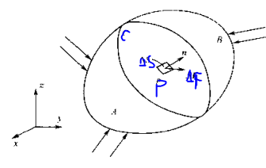
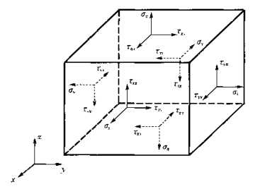
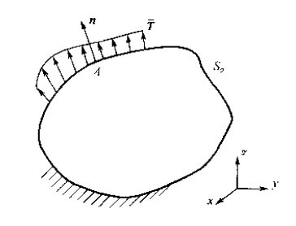

# 弹塑性力学[^1]--应力分析(1)

## 弹性力学的研究对象和内容

​	物体受外载荷作用所产生的形状和大小的改变，称之为变形或形变，通常考虑的外部载荷包括机械外力、温度、电磁力等各种物理因素。如果将引起变形的外部载荷移去后，物体能完全回复到原来的形状和大小，这种变形称为弹性变形。

# 应力分析

## 应力矢量

考查平面C上包括P点在内的微小面积$\Delta S$，如下图所示

P点内的应力集度可使用如下式定义的应力矢量$\mathbf {T(n)}$描述
$$
\mathbf{T(n)}=\lim_{\Delta S\to 0} \frac{\Delta \mathbf{F} }{\Delta \mathbf{S}}
$$
在笛卡尔坐标系下，应力矢量可以表示为
$$
\mathbf{T(n)}=T_x \mathbf{e}_x +T_y \mathbf{e}_y +T_z \mathbf {e}_z  \tag{1.1}
$$
在P点的领域内截取一个微六面体，若微面的外法线方向与坐标轴的正方向一直，则称为正面；若与坐标轴正方向相反，则称为负面。每个应力矢量沿空间坐标轴的3个分量中，一个分量垂直于作用面，用$\sigma$表示，两个分量平行与作用面，是剪应力，用$\tau$表示

$$
\mathbf{T(e_x)}=\sigma_{xx}\mathbf{e}_x+\tau_{xy} \mathbf {e}_y+\tau_{xz}\mathbf{e}_z\\
\mathbf{T(e_y)}=\tau_{yx} \mathbf{e}_x+\sigma_{yy}\mathbf {e}_y+\tau_{yz}\mathbf{e}_z\\
\mathbf{T(e_z)}=\tau_{zx} \mathbf {e}_x+\tau_{zy}\mathbf{e}_z+\sigma_{zz}\mathbf{e}_z  \tag{1.3}
$$
式中每个应力分量有两个下标，前一个下标代表作用面的外法线方向，后一个下标代表应力的作用方向。为了简便起见，以后正应力的两个相同下表只保留其中一个。3个应力矢量共9个分量，使用张量的记法，9个应力分量记为
$$
[\sigma_{ij}]=
\left[
\begin{matrix}
\sigma_{11} & \sigma_{12} & \sigma_{13}\\
\sigma_{21} &\sigma_{22} &\sigma_{23} \\
\sigma_{31} & \sigma_{32} & \sigma_{33}   
\end{matrix}
\right]
$$
应力正负号规定：正面上的应力若指向坐标轴正方向为正，否则为负；负面上的应力若指向坐标轴负方向为正，否则为负。式（1.3）使用张量记法可以表示为
$$
\mathbf{T(e_i)}=\sigma_{i\mathbf k} \mathbf{e_k}   \tag{1.4}
$$

## Cauchy应力公式（斜面应力公式）

斜面上的应力矢量
$$
\mathbf{T(n)}=\mathbf{T}(\mathbf e_x) l+\mathbf{T}(\mathbf e_y)m+\mathbf{T}(\mathbf e_z)n  \tag{1.5}
$$
这就是著名的Cauchy公式，又称斜面应力公式，其实质是微四面体的平衡条件。

式（1.5）用分量的形式表示为
$$
T_x=\sigma_{x}l+\tau _{yx}m+\tau_{zx}n \\
T_y=\tau_{xy}+\sigma_{y}m+\tau_{zy}n   \\
T_z=\tau_{xz}+\tau_{yz}m+\sigma_{z} n  \tag{1.6}
$$
使用张量指标记法，式（1.5）和式（1.6）可分别表示为
$$
\mathbf{T(n)}=n_i \mathbf{T}(\mathbf{e}_i) \tag{1.7a}
$$

$$
T_i=n_i \sigma_{ij}     \tag{1.7b}
$$

Cauchy公式有两个重要的应用：

（1）求斜面的各种应力。

（2）确定力的边界条件。

## 平衡微分方程

根据应力函数的连续性、Taylor级数知识，以六面体微元推导。

$$
\frac {\partial \sigma _x}{\partial x}+\frac {\partial \tau_{yz}}{\partial y}+\frac {\partial \tau_{zx}}{\partial z}+F_x=0     \tag{1.10a}
$$

$$
\frac{\partial \tau_{xy}}{\partial x}+\frac {\partial \sigma_{y}}{\partial y}+\frac{\partial \tau_{zy}}{\partial z}+F_y=0  \tag{1.11b}
$$

$$
\frac{\partial \tau_{xz}}{\partial x}+\frac{\partial \tau_{yz}}{\partial y}+\frac {\partial \sigma_{z}}{\partial z}+F_z=0  \tag{1.11c}
$$

平衡方程的张量表示为
$$
\sigma_{ij,i}+F_j=0  \tag{1.13}
$$
式中
$$
\sigma_{ij,i}=\frac{\partial \sigma_{1j}}{\partial x_1}+\frac{\partial{\sigma_{2j}}}{\partial x_2}+\frac{\partial \sigma_{3j}}{\partial x_3}
$$

## 边界条件

当物体的一部分边界上给定了分布的表面力，称这部分边界为力边界，使用$S_\sigma$表示。力边界条件指边界上个点的应力与已知表面力应满足的关系。力的边界条件实质上是物体边界点的平衡条件。如下图，对照Cauchy公式，则该店的应力分量应满足下式
$$
\sigma_xl+\tau_{yx}m+\tau_{zx}=\overline{T}_x  \tag{1.14a}
$$

$$
\tau_{xy}l+\sigma_{y}m+\tau_{zy}=\overline{T}_y  \tag{1.14b}
$$

$$
\tau_{xz}l+\tau_{yz}m+\tau_{z}n=\overline{T}_z  \tag{1.14c}
$$

[^1]: 陈明祥. 弹塑性力学[M]. 北京: 科学出版社, 2007.
